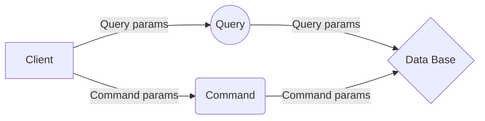

# RideCompanion

**RideCompanion** – это программное обеспечение **с открытым исходным кодом**, предназначенное для предоставления пользователям удобного инструмента поиска попутки и попутчика для совместной междугородней поездки. Этот сервис также поддерживает **аутентификацию**, чтобы гарантировать безопасность пользователей, а также дополнительные функции, такие как **уведомления** о изменениях в поездке и настраиваемые **фильтры** поиска пассажиров и водителей.

**Пользователи** RideCompanion  — это люди, **зарегистрированные** в системе как **водители** или как **попутчики**. Они могут создавать **объявления** о поиске попутки или попутчика, в которых указываются детали маршрута, **цена** поездки и количество пассажиров. Цена поездки может назначаться либо водителем, либо попутчиком в зависимости от того, кто ищет попутку или попутчика.  

## Технологии

RideCompanion  написан используя **технологии .NET 7, PostgreSQL и SQRS**. Код проекта выпущен по свободно распространяемой лицензии **GPLv3 (GNU GENERAL PUBLIC LICENSE Version  3)**. Это значит, что пользователи смогут взять **исходный код** и модифицировать его для личных нужд, при условии, что они **не меняют лицензию и указывают авторство исходного проекта**. В частности, это позволяет пользователям использовать RideCompanion  **бесплатно** и иметь полное право на **модификацию** кода.

## CQRS

SQRS (Structured  Query Language Request System) позволяет разработчикам создавать запросы для чтения данных из базы данных и команды для изменения данных в базе данных. Это обеспечивает разработчикам мощные инструменты для запроса и изменения данных в базе данных, используя стандартизированные SQL-синтаксические инструкции. Используя SQRS, разработчики могут использовать простые и гибкие инструкции SQL для управления данными в современных базах данных.

> **Внимание:** В данном проекте CQRS реализуется на базе Mediatr.

Примерная схема работы:



## Migrations
```
dotnet ef migrations add EntitiesNullable --context ApplicationDbContext --project .\Shared.Migrations\ --startup-project .\RideCompanion\
dotnet ef database update EntitiesNullable --context ApplicationDbContext --project .\Shared.Migrations\ --startup-project .\RideCompanion\
dotnet ef database update --context ApplicationDbContext --project .\Shared.Migrations\ --startup-project .\RideCompanion\
dotnet ef migrations remove --context ApplicationDbContext --project .\Shared.Migrations\ --startup-project .\RideCompanion\
```


